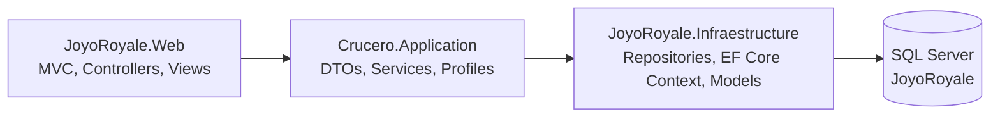

# JoyoRoyale

JoyoRoyale is a cruise booking and management web application built with ASP.NET Core MVC, Entity Framework Core, and SQL Server, organized in a layered architecture.

## Repository Origin (GitLab -> GitHub)

This project was originally developed in GitLab and later uploaded to GitHub as a full snapshot for convenience.

- The GitHub repository contains the full project codebase.
- It does not preserve the complete intermediate commit history from the original GitLab workflow.
- Current GitHub state: a single visible commit (`Initial commit`).

## Table of Contents

- [Architecture](#architecture)
- [Tech Stack](#tech-stack)
- [Project Structure](#project-structure)
- [Prerequisites](#prerequisites)
- [Configuration](#configuration)
- [Database Setup](#database-setup)
- [Run Locally](#run-locally)
- [Test Users](#test-users)
- [Functional Modules](#functional-modules)
- [External Integrations](#external-integrations)
- [Logging and Diagnostics](#logging-and-diagnostics)
- [Technical Notes](#technical-notes)

## Architecture

Layered architecture with clear separation of concerns:



Layer summary:

- `JoyoRoyale.Web`: presentation layer (MVC controllers, views, middleware, authentication).
- `Crucero.Application`: application/business layer (DTOs, service contracts, service implementations, AutoMapper profiles).
- `Crucero.Infraestructure`: data access layer (EF Core context, repository implementations, persistence models).

## Tech Stack

- .NET 8 (`net8.0` in all three projects)
- ASP.NET Core MVC
- Entity Framework Core + SQL Server
- AutoMapper
- Serilog
- DinkToPdf (PDF invoice generation)
- WCF SOAP Client (BCCR exchange rate service)
- Bootstrap + jQuery

Verified SDK during analysis: `9.0.312`.

## Project Structure

```text
appJoyoRoyale.sln
Crucero.Application/
Crucero.Infraestructure/
JoyoRoyale/
Base con datos JoyoRoyale Final.sql
Base de datos/Base Joyo 3.3.sql
```

Key files:

- Solution file: `appJoyoRoyale.sln`
- Web startup and DI: `JoyoRoyale/Program.cs`
- EF Core context: `Crucero.Infraestructure/Data/JoyoRoyaleContext.cs`
- Development config: `JoyoRoyale/appsettings.Development.json`
- Recommended database script with seed data: `Base con datos JoyoRoyale Final.sql`

## Prerequisites

1. Windows 10/11 (recommended for environment parity with current setup).
2. .NET SDK 8 or newer (SDK 9 can build `net8.0` projects).
3. SQL Server (Developer or Express) and SQL Server Management Studio.
4. Visual Studio 2022 or VS Code with C# tooling.
5. Internet access for:
	 - BCCR SOAP exchange-rate service,
	 - SMTP email sending (for invoice email feature).

## Configuration

Primary development configuration is in `JoyoRoyale/appsettings.Development.json`.

Configure at minimum:

```json
{
	"ConnectionStrings": {
		"SqlServerDataBase": "Server=localhost;Database=JoyoRoyale;Integrated Security=false;user id=sa;password=YOUR_PASSWORD;Encrypt=false;"
	},
	"Crypto": {
		"Secret": "YOUR_SECRET_32_PLUS"
	},
	"SmtpConfiguration": {
		"Password": "YOUR_SMTP_APP_PASSWORD",
		"UserName": "your_email@domain.com",
		"Server": "smtp.gmail.com",
		"PortNumber": 587,
		"FromName": "JoyoRoyale",
		"EnableSsl": true
	}
}
```

Security recommendation:

- Do not commit real secrets to public repositories.
- Rotate exposed credentials (SMTP passwords, tokens, keys) immediately.

## Database Setup

Two SQL scripts are included:

1. `Base con datos JoyoRoyale Final.sql`
	 - Creates the full `JoyoRoyale` database.
	 - Creates tables and foreign keys.
	 - Inserts seed data.
	 - Recommended for quick local setup.

2. `Base de datos/Base Joyo 3.3.sql`
	 - Creates schema and partial seed data.
	 - Includes `OPENROWSET` steps for image loading from local paths (may require path and permission adjustments).

Suggested setup steps:

1. Open SQL Server Management Studio.
2. Execute `Base con datos JoyoRoyale Final.sql`.
3. Confirm the `JoyoRoyale` database exists.
4. Verify base data exists in core tables (`Roles`, `Usuarios`, `Cruceros`, etc.).

## Run Locally

From repository root:

```bash
dotnet restore appJoyoRoyale.sln
dotnet build appJoyoRoyale.sln
dotnet run --project JoyoRoyale/JoyoRoyale.Web.csproj
```

Launch profiles found in configuration:

- HTTP: `http://localhost:5282`
- HTTPS: `https://localhost:7226`

Default route:

- `Login/Index` (configured in `Program.cs`).

## Test Users

With `Base con datos JoyoRoyale Final.sql`, sample users include:

- Client:
	- Email: `Bran8907@gmail.com`
	- Password: `123456`
- Administrator:
	- Email: `Brandon28200075@gmail.com`
	- Password: `123456`

You can also register new client accounts from the registration screen.

## Functional Modules

Main controllers:

- `LoginController`: sign-in, sign-out, forbidden access page.
- `UsuariosController`: client user registration.
- `CruceroController`: cruise listing, details, and admin creation.
- `BarcoController`: ship listing, details, and admin maintenance.
- `HabitacionController`: room catalog and admin maintenance.
- `ComplementoController`: add-on management for admins.
- `ReservaController`:
	- reservation creation,
	- availability validation,
	- reservation detail,
	- PDF invoice generation,
	- invoice email sending,
	- admin reservation listing.

Authorization model:

- Cookie-based authentication.
- Role-based access (`Administrador`, `Cliente`).
- Administrative screens protected with `[Authorize(Roles = "Administrador")]`.

## External Integrations

1. BCCR exchange rate service
	 - SOAP client: `JoyoRoyale/Connected Services/BCCR/Reference.cs`
	 - Application service: `JoyoRoyale/Services/BccrService.cs`

2. SMTP email
	 - Invoice delivery through `ServiceCorreo`.
	 - Requires valid SMTP credentials.

3. PDF generation
	 - DinkToPdf with `libwkhtmltox` binaries in `JoyoRoyale/LibreriaPDF/`.
	 - Invoice template: `JoyoRoyale/Views/Reserva/FacturaReserva.cshtml`.

## Logging and Diagnostics

Serilog is configured for request and application logging.

Expected log outputs in `JoyoRoyale/Logs/`:

- `Info-*.log`
- `Debug-*.log`
- `Warning-*.log`
- `Error-*.log`
- `Fatal-*.log`

## Technical Notes

1. Build status
	 - The solution builds successfully.
	 - Warnings are present (mainly nullability and analyzer suggestions).

2. NuGet advisory
	 - `AutoMapper 14.0.0` is flagged with warning `NU1903` (high severity advisory).
	 - Recommended action: update package version and validate compatibility.

3. Automated tests
	 - No dedicated test projects were found in the solution.

4. Publishing context
	 - This GitHub repository is a complete project snapshot migrated from a GitLab development workflow, without full intermediate commit traceability.
