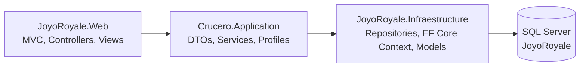

# JoyoRoyale

JoyoRoyale is a cruise booking and management web application built with ASP.NET Core MVC, Entity Framework Core, and SQL Server, organized in a layered architecture.

## Repository Origin (GitLab -> GitHub)

This project was originally developed in GitLab and later uploaded to GitHub as a full snapshot for convenience.

- The GitHub repository contains the full project codebase.
- It does not preserve the complete intermediate commit history from the original GitLab workflow.
- Current GitHub state: a single visible commit (`Initial commit`).

## Table of Contents

- [Architecture](#architecture)
- [Tech Stack](#tech-stack)
- [Project Structure](#project-structure)
- [Prerequisites](#prerequisites)
- [Quick Start](#quick-start)
- [Configuration](#configuration)
- [Database Setup](#database-setup)
- [Run Locally](#run-locally)
- [Verification Checklist](#verification-checklist)
- [Test Users](#test-users)
- [Functional Modules](#functional-modules)
- [External Integrations](#external-integrations)
- [Logging and Diagnostics](#logging-and-diagnostics)
- [Troubleshooting](#troubleshooting)
- [Technical Notes](#technical-notes)

## Architecture

Layered architecture with clear separation of concerns:



Layer summary:

- `JoyoRoyale.Web`: presentation layer (MVC controllers, views, middleware, authentication).
- `Crucero.Application`: application/business layer (DTOs, service contracts, service implementations, AutoMapper profiles).
- `Crucero.Infraestructure`: data access layer (EF Core context, repository implementations, persistence models).

## Tech Stack

- .NET 8 (`net8.0` in all three projects)
- ASP.NET Core MVC
- Entity Framework Core + SQL Server
- AutoMapper
- Serilog
- DinkToPdf (PDF invoice generation)
- WCF SOAP Client (BCCR exchange rate service)
- Bootstrap + jQuery

Verified SDK during analysis: `9.0.312`.

## Project Structure

```text
appJoyoRoyale.sln
Crucero.Application/
Crucero.Infraestructure/
JoyoRoyale/
Base con datos JoyoRoyale Final.sql
Base de datos/Base Joyo 3.3.sql
```

Key files:

- Solution file: `appJoyoRoyale.sln`
- Web startup and DI: `JoyoRoyale/Program.cs`
- EF Core context: `Crucero.Infraestructure/Data/JoyoRoyaleContext.cs`
- Development config: `JoyoRoyale/appsettings.Development.json`
- Recommended SQL seed script: `Base con datos JoyoRoyale Final.sql`

## Prerequisites

1. Windows 10/11 (recommended for parity with this setup).
2. .NET SDK 8 or newer (SDK 9 can build `net8.0` projects).
3. SQL Server (Developer or Express) and SQL Server Management Studio.
4. Visual Studio 2022 or VS Code with C# tooling.
5. Internet access for optional integrations:
	- BCCR SOAP exchange rate.
	- SMTP email delivery.

## Quick Start

If you want to run the project quickly:

1. Clone the repository.
2. Create/update database using `Base con datos JoyoRoyale Final.sql`.
3. Copy `JoyoRoyale/appsettings.Development.example.json` to `JoyoRoyale/appsettings.Development.json`.
4. Set valid values in `JoyoRoyale/appsettings.Development.json`.
5. Run:

```bash
dotnet restore appJoyoRoyale.sln
dotnet build appJoyoRoyale.sln
dotnet run --project JoyoRoyale/JoyoRoyale.Web.csproj
```

## Configuration

Primary development configuration file:

- `JoyoRoyale/appsettings.Development.json`

Template file committed in the repository:

- `JoyoRoyale/appsettings.Development.example.json`

First-time setup commands (PowerShell):

```powershell
Copy-Item "JoyoRoyale/appsettings.Development.example.json" "JoyoRoyale/appsettings.Development.json"
```

Then edit `JoyoRoyale/appsettings.Development.json` and replace every `CHANGE_ME` value.

Minimum required keys:

```json
{
  "ConnectionStrings": {
	 "SqlServerDataBase": "Server=localhost;Database=JoyoRoyale;Integrated Security=false;user id=sa;password=YOUR_PASSWORD;Encrypt=false;"
  },
  "Crypto": {
	 "Secret": "YOUR_SECRET_WITH_AT_LEAST_32_CHARACTERS"
  },
  "SmtpConfiguration": {
	 "Password": "YOUR_SMTP_APP_PASSWORD",
	 "UserName": "your_email@domain.com",
	 "Server": "smtp.gmail.com",
	 "PortNumber": 587,
	 "FromName": "JoyoRoyale",
	 "EnableSsl": true
  },
  "BccrSettings": {
	 "Token": "YOUR_BCCR_TOKEN",
	 "Email": "your_email@domain.com",
	 "NombreApp": "JoyoRoyale"
  }
}
```

Important behavior:

- If `BccrSettings` is not configured, exchange-rate features return no rate data.
- If `SmtpConfiguration` is not configured, invoice email sending fails gracefully.
- If `Crypto.Secret` is invalid, legacy password verification cannot run.

Security recommendations:

- Do not commit real secrets.
- Use environment-specific config or user secrets for local/dev.
- Rotate credentials if they were ever exposed.

## Database Setup

Two SQL scripts are included:

1. `Base con datos JoyoRoyale Final.sql`
	- Creates database, schema, constraints, and seed data.
	- Recommended for local development.

2. `Base de datos/Base Joyo 3.3.sql`
	- Alternative schema/data script.
	- Includes `OPENROWSET` image-loading steps that may require path and permission changes.

Recommended steps:

1. Open SQL Server Management Studio.
2. Execute `Base con datos JoyoRoyale Final.sql`.
3. Confirm database `JoyoRoyale` exists.
4. Confirm seed data in core tables (`Roles`, `Usuarios`, `Cruceros`, etc.).

## Run Locally

From repository root:

```bash
dotnet restore appJoyoRoyale.sln
dotnet build appJoyoRoyale.sln
dotnet run --project JoyoRoyale/JoyoRoyale.Web.csproj
```

Launch URLs (from launch profile):

- HTTP: `http://localhost:5282`
- HTTPS: `https://localhost:7226`

Default route:

- `Login/Index`

## Verification Checklist

After startup, verify these points:

1. Login page opens at `Login/Index`.
2. You can log in with a demo user.
3. Cruise/ship/room listings load without server error.
4. Reservation create view loads while authenticated.
5. PDF invoice generation opens in-browser.
6. Logs are being written into the `Logs` folder.

## Test Users

Seed script creates demo users:

- Client:
  - Email: `cliente.demo@joyoroyale.local`
  - Password: `123456`
- Administrator:
  - Email: `admin.demo@joyoroyale.local`
  - Password: `123456`

Note on password storage:

- New/updated accounts use PBKDF2 hash storage.
- Legacy encrypted passwords are automatically upgraded after successful login.

## Functional Modules

Main controllers:

- `LoginController`: sign-in, sign-out, forbidden page.
- `UsuariosController`: client registration.
- `CruceroController`: cruise listing/details and admin creation.
- `BarcoController`: ship listing/details and admin maintenance.
- `HabitacionController`: room listing/details and admin maintenance.
- `ComplementoController`: add-on maintenance.
- `ReservaController`:
  - reservation flow,
  - availability checks,
  - reservation details,
  - invoice PDF generation,
  - invoice email sending,
  - reservation administration.

Authorization model:

- Cookie authentication.
- Role-based access (`Administrador`, `Cliente`).
- Administrative actions use role-based authorization attributes.

## External Integrations

1. BCCR exchange-rate service
	- SOAP client: `JoyoRoyale/Connected Services/BCCR/Reference.cs`
	- Service wrapper: `JoyoRoyale/Services/BccrService.cs`

2. SMTP email
	- Invoice delivery via `ServiceCorreo`.
	- Requires valid SMTP credentials.

3. PDF generation
	- DinkToPdf + `libwkhtmltox` binaries in `JoyoRoyale/LibreriaPDF/`.
	- Invoice view template: `JoyoRoyale/Views/Reserva/FacturaReserva.cshtml`.

## Logging and Diagnostics

Serilog is configured for file + console logging.

Expected output files in `JoyoRoyale/Logs/`:

- `Info-*.log`
- `Debug-*.log`
- `Warning-*.log`
- `Error-*.log`
- `Fatal-*.log`

## Troubleshooting

1. Build succeeds but app login fails immediately
	- Verify `Crypto.Secret` length is at least 32 chars.
	- Verify DB connection string points to your local SQL Server.

2. Cannot fetch exchange rate
	- Verify `BccrSettings.Token` and `BccrSettings.Email`.
	- Confirm outbound internet access.

3. Invoice email not sent
	- Verify SMTP server, username, password, and SSL settings.
	- Use an app password when required by provider.

4. Database errors on startup/use
	- Ensure `JoyoRoyale` DB exists and seed script completed.
	- Re-run `Base con datos JoyoRoyale Final.sql` in a clean DB.

5. PDF generation issues
	- Confirm `libwkhtmltox.dll` is present in `JoyoRoyale/LibreriaPDF/`.
	- Ensure application has read access to this path.

## Technical Notes

1. Build status
	- Solution builds successfully.
	- Some warnings still exist (mainly nullability and code cleanup items).

2. Dependency advisory
	- `AutoMapper 14.0.0` reports warning `NU1903`.
	- Recommended: update package and validate behavior.

3. Test coverage
	- No dedicated automated test projects are currently included.

4. Publishing context
	- This GitHub repository is a full snapshot migrated from a GitLab development workflow and does not contain complete intermediate commit history.
